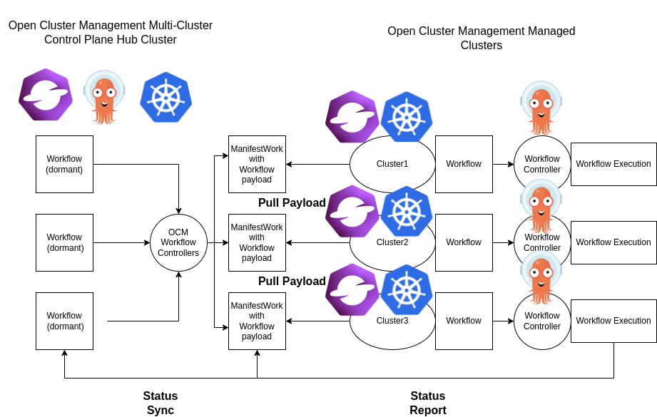

# Argo Workflow Open Cluster Management Multicluster
Enable [Argo Workflow](https://argoproj.github.io/argo-workflows/) Multi-cluster capabilities by using
the [Open Cluster Management (OCM)](https://open-cluster-management.io/) APIs and components.

## Description
By using this project, users can propagate Argo Workflow to remote clusters based on availabile cluster resource usages.



There are multiple components in this project.

- Placement controller watches the Workflow CR and evaluates the [Placement](https://open-cluster-management.io/concepts/placement/) decision, then annotates the Workflow with the remote cluster target.
- ManifestWork controller watches the Workflow CR with the remote cluster target and creates [ManifestWork](https://open-cluster-management.io/concepts/manifestwork/) CR which will propagate the Workflow to the intended remote cluster.
- Status controller that updates the Workflow CR status on the hub cluster with the remote cluster's Workflow's execution results.
- Install Add-on that automates the installation of Argo Workflows to all the managed clusters.
See the [Install Add-on README](addons/hub/install/README.md) for more details.
- Workflow Status Sync Add-on that syncs the entire Argo Workflow status from managed clusters to hub cluster
See the [Status Sync Add-on README](addons/hub/status_sync/README.md) for more details.

See the [Workflow example](example/hello-world.yaml) for the required label(s) and annotation(s).

## Dependencies
- The Open Cluster Management (OCM) multi-cluster environment needs to be set up. See the [OCM website](https://open-cluster-management.io/) on how to set up the environment.
- In this multi-cluster model, OCM will provide the cluster inventory and ability to deliver workload to the remote/managed clusters.

## Developer Build
1. Build the project.
```
make docker-build
```

2. Optional: load the built image to KinD clusters.
```
kind load docker-image --name=hub quay.io/open-cluster-management/argo-workflow-multicluster:latest
kind load docker-image --name=cluster1 quay.io/open-cluster-management/argo-workflow-multicluster:latest
```


## Getting Started
1. Set up an OCM Hub cluster and register at least one OCM Managed cluster.

2. On the hub cluster, install the Argo Workflow and Argo Workflow Status Result CRDs:
```
kubectl apply -f hack/crds/
```

3. On the hub cluster, install the OCM Argo Workflow Install Addon by running:
```
kubectl apply -f deploy/addon/install/
```
This will automate the installation of Argo Workflows to the managed clusters. See the [Install Add-on README](addons/hub/install/README.md) for more details.
For manual installation of Argo Workflows, elevate the OCM agent permission to access 
the Workflow objects by `kubectl apply -f example/managed`.
This manual privilege escalation is not necessary when using the OCM Argo Workflow Install Addon.

4. On the hub cluster, install the OCM Argo Workflow Status Sync Addon by running:
```
kubectl apply -f deploy/addon/status-sync/
```
This will install the status sync agent to all the managed clusters. See the [Status Sync Add-on README](addons/hub/status_sync/README.md) for more details.


5. On the hub cluster, deploy the Argo Workflow Multicluster manager:
```
kubectl apply -f deploy/argo-workflow-multicluster/
```

6. On the hub cluster, apply the ManagedClusterSetBinding and Placement.
```
kubectl apply -f example/clusterset-binding.yaml
kubectl apply -f example/workflow-placement.yaml
```

7. On the hub cluster, create the example Workflow.
```
kubectl apply -f example/hello-world.yaml
```

8. On the managed cluster, check the Workflow that was executed.
```
$ kubectl get workflow
NAME                       STATUS      AGE     MESSAGE
hello-world-multicluster   Succeeded   3m52s
```

9. On the hub cluster, check the Workflow to see the status is now synced from the managed cluster.
```
$ kubectl get workflow hello-world-multicluster -o yaml 
...
status:
...
  conditions:
  - status: "False"
    type: PodRunning
  - status: "True"
    type: Completed
  finishedAt: "2022-11-12T21:57:19Z"
...
  phase: Succeeded
  progress: 1/1
  resourcesDuration:
    cpu: 9
    memory: 9
...
```

## What's next

See the OCM [Extend the multicluster scheduling capabilities with Placement API](https://open-cluster-management.io/scenarios/extend-multicluster-scheduling-capabilities/) 
documentation on how to schedule workload based on available cluster resources.

## Community, discussion, contribution, and support

Check the [CONTRIBUTING Doc](CONTRIBUTING.md) for how to contribute to the repo.

### Communication channels

Slack channel: [#open-cluster-mgmt](https://kubernetes.slack.com/channels/open-cluster-mgmt)

## License

This code is released under the Apache 2.0 license. See the file [LICENSE](LICENSE) for more information.
